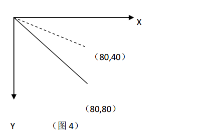

# scale 方法（缩放）

   scale(sx,sy)
   
scale() 方法为画布的当前变换矩阵添加一个缩放变换。缩放通过独立的水平和垂直缩放因
子来完成。例如，传递一个值 2.0 和 0.5 将会导致绘图路径宽度变为原来的两倍，而高度
变为原来的 1/2。指定一个负的 sx 值，会导致 X 坐标沿 Y 轴对折，而指定一个负的 sy 会
导致 Y 坐标沿着 X 轴对折.

    ctx.scale(1, -1);// 改变 Y 轴方向 180°
    
变换后的实际坐标如图 3 中的虚线所示位置 

    ctx.scale(1, 0.5);//Y 轴实际单位 0.5 倍化
    
变换后的实际坐标如图 4 中的虚线所示位置 