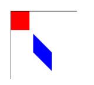
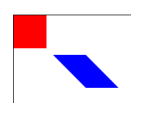
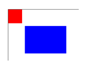
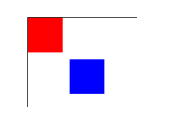
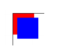
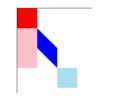

# transform 方法（变形）

    transform(m11,m12,m21,m22,dx,dy)
    setTransform(m11,m12,m21,m22,dx,dy)

## transform

    transform(m11,m12,m21,m22,dx,dy)

是对当前坐标系进行矩阵变换。变换规则可以是将变换前的坐标空间的原点移动至(dy,dy)处，同新坐标系下的点的位置需要通过下属方法来获取。

$$\begin{bmatrix} x\\y \end{bmatrix} =  \begin{bmatrix}x&m11&m12\\y&m21&m22 \end{bmatrix}$$  

通过下面的例子详细说明下：

    var ctx = document.getElementById('canvas').getContext('2d');
    ctx.strokeStyle = 'red';
    ctx.save();
    drawRect(0,0,50,50,'red',ctx);
    ctx.transform(1, 1 , 0, 1 , 60, 60);
    drawRect(0,0,50,50,'blue',ctx);
    
    function drawRect(a,b,w,h,color,ctx){
        ctx.save();
        ctx.fillStyle = color;
        ctx.fillRect(a,b,w,h);
        ctx.restore();
    }

效果图： 

首先我们在未变动坐标系时，在原点处绘制一个长宽各为 50 的矩形（红色部分）；那么此时该矩形的四个角的顶点坐标为(0,0)、(0,50)、(50,0)、(50,50)；

接着我们调用 transform 方法对进行坐标系矩阵变换。那么首先原点由原来的(0,0)移动到了(60,60)处。那么这个时候绘制同样的(0,0,50,50)的矩形时，就需要将上边的坐标进行转换。比如(50,50)，我们使用上述公式的矩阵乘法，会得到新的坐标为(50*1+50*0,50*1+50*1) = (50,100)。由于原点在(60,60)处，因此实际该点的坐标相对于原坐标系的值应(110,160)。

如果我们将上面的示例代码中的 
  
    ctx.transform(1, 1 , 0, 1 , 60, 60)

替换成

    ctx.transform(1, 0 , 1, 1 , 60, 60)
    
那么得到的图形将会如下： 

通过上面可以看出，当 **m11** 和 **m22** 都为 1 时，通过改变 **m12** 和 **m21** 可以对图
形进行 **Y** 方向和 **X** 方向上的**拉伸变形**，而当 **m12** 和 **m21** 不变时，对于 **m11** 和 **m22**
的增加，则是改变在 **X** 方向和 **Y** 方向上的**实际线段距离倍数**。比如当使用

    ctx.transform(3, 0 , 0, 2 , 60, 60)

时得到下图：

矩形长变为原来的 3 倍，而宽为原来的 2 倍。此时相当于使用了 

    ctx.translate(60, 60);
    ctx.scale(3,2)

如果我们的变形矩阵是单位矩阵也就是 $$\begin{bmatrix} 1&0\\0&1 \end{bmatrix}$$（单位矩阵，抑或可以转化成单位矩阵）那么其作用相当于 `translate()`方法。比如我们将上面的示例代码中的

    ctx.transform(1, 1 , 0, 1 , 60, 60)

替换成

    ctx.transform(1, 0 , 0, 1 , 60, 60)
    
那么得到的图形将会如下：

可见其跟使用 `ctx.translate(60, 60)`相同。如果我们的变形矩阵是$$\begin{bmatrix} -1&0\\0&-1 \end{bmatrix}$$ 那么将上面的示例代码中的

    ctx.transform(1, 1 , 0, 1 , 60, 60)

替换成

    ctx.transform(-1, 0 , 0, -1 , 60, 60)
    
那么得到的图形将会如下: 

可见当为负单位矩阵时，其绘制区域是在坐标系的**第四象限**。

其他的就不在枚举了，可以在使用过程体会。具体的变形还是要能根据提供的那个公式
决定。

> ***Notes:*** 如果任意一个参数是无限大，变形矩阵也必须被标记为无限大，否则会抛出异常。

## setTransform

    setTransform(m11,m12,m21,m22,dx,dy)

重置变形矩阵。当调用该方法是，首先会将当前的矩阵重置为单位矩阵，也就是恢复 Canvas 的坐标系为默认的坐标系。然后再用相同的参数调用 transform 方法设置矩阵。

一般的如果要恢复到默认坐标系可以使用

    ctx.setTransform(1,0,0,1,0,0)
    
方法即可。下面给出段实例代码以供参考。

    var ctx = document.getElementById('canvas').getContext('2d');
    ctx.strokeStyle = 'red';
    ctx.save();
    drawRect(0,0,50,50,'red',ctx);
    // 变形矩阵.移动坐标原点到(50,50)
    // Y轴拉伸为原来的2倍
    ctx.transform(1, 1 , 0, 1 , 50, 50);
    // 此时应该绘制出一个平行四边形.
    drawRect(0,0,50,50,'blue',ctx);
    // 在上一变形矩阵的基础上，移动坐标到(50,50)相当于原坐标系的(100,150);
    // Y轴缩短为原来的2倍。所以此时Y应为不变
    ctx.transform(1, -1 , 0, 1 , 50, 50);
    // 此时应该绘制出一个矩形
    drawRect(0,0,50,50,'#ade',ctx);
    // 恢复坐标系。
    ctx.setTransform(1,0,0,1,0,0);
    // 绘制一个粉色的矩形
    drawRect(0,50,50,100,'pink',ctx);
    
    function drawRect(a,b,w,h,color,ctx){
        ctx.save();
        ctx.fillStyle = color;
        ctx.fillRect(a,b,w,h);
        ctx.restore();
    }
    
效果图：